# 🎧 LB Playground — Data Engineering Playground (`lbplayground`)

This project implements a **production-inspired data pipeline** for the [ListenBrainz](https://listenbrainz.org/) dataset.
It combines **modern orchestration (Airflow)**, **SQL-first transformations (DuckDB)**, and **lightweight BI (Streamlit)** into a reproducible **Lakehouse-style architecture**.

---

## ✅ Action Plan (Progress Tracker)

* ✅ Containerization skeleton (Airflow, DuckDB, Streamlit)
* ✅ Data orchestration with **Airflow DAGs**
* ✅ **Raw → Staging → Curated → Marts → Reporting** layered architecture
* ✅ Idempotent SQL transformations (safe re-runs)
* ✅ **Slowly Changing Dimension Type 2 (SCD2)** for user names
* ✅ Daily **snapshotting** of active users
* ✅ **Streamlit dashboards** for reporting
* ✅ **Data Quality checks** (custom SQL DAG with 7 checks)
* 🚧 Data Governance Checks *(planned)*
* 🚧 CI/CD hardening (GitHub Actions full setup) *(planned)*

---

## 📂 Repository Structure

```text
lbplayground/
├── airflow/               
│   ├── dags/              # Airflow DAGs
│   ├── logs/              # Task logs
│   ├── plugins/           
│   └── sql/               # SQL transformations
│       ├── raw/           # ingestion (JSON → DuckDB)
│       ├── staging/       # flattening
│       ├── production/    # curated, marts, dq, dc
│       │   ├── curated/   # fact/dim tables
│       │   ├── dc/        # data conformance checks
│       │   ├── dq/        # data quality checks
│       │   └── marts/     # aggregates
│       ├── reporting/     # reporting queries/views
│       └── v1/            # (initial drafts / legacy)
├── data/                  # source ListenBrainz JSONL
├── docker/                # Dockerfiles
├── metabase_plugins/      # (optional BI connectors)
├── reports/               # static screenshots for README
├── streamlit_app/         
│   └── app.py             # BI dashboard
├── wiki/                  # documentation
│   ├── images/            
│   ├── airflow.md         
│   ├── data_dictionary.md 
│   ├── data_model.md      
│   ├── infra.md           
│   └── play_duckdb.md     
├── .env                   # env vars
├── .gitignore
├── docker-compose.yml
├── requirements.txt
└── README.md
```

---

## ⚙️ Tech Stack

* **DuckDB** – embedded OLAP database
* **Apache Airflow** – DAG orchestration
* **Streamlit** – BI/dashboarding
* **Python + SQL** – ETL + transformations
* **Postgres** – Airflow metadata DB
* **Docker Compose** – reproducible infra
* *(Optional)* **Great Expectations** – data quality checks
* **GitHub Actions** – CI/CD

---

## 🏗️ Architecture

Please find the below archtiecutre made for this, usually there is an exacly draw file attached in the repo.

  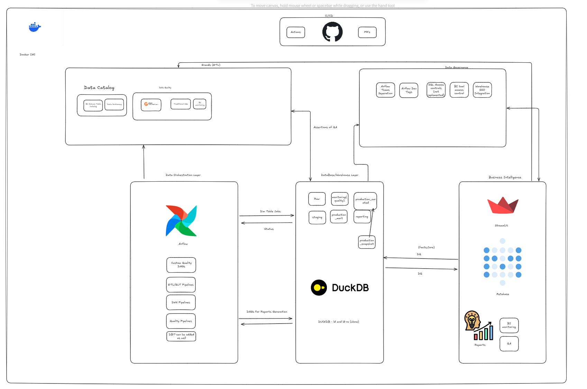

We follow a **layered Lakehouse approach** with **hybrid dimensional modeling**:

* **Raw Layer** – `raw.listens_jsonl` (JSON ingestion)
* **Staging Layer** – `staging.listens_flat` (flattened listens)
* **Curated Layer** – `dim_user` (SCD2), `fact_listen`, `snapshots_user_activity`
* **Marts Layer** – `mart_user_activity`, `mart_track_performance`
* **Reporting Layer** – SQL views answering reporting questions
* **Monitoring Layer** – 7 SQL checks (row counts, nulls, duplicates, future dates, referential integrity, SCD2 validity, etc.) → results stored in `monitoring.data_quality_results`

📖 See: [Data Model](wiki/data_model.md) | [Data Dictionary](wiki/data_dictionary.md)

## Data Flow Architecture

        ┌───────────────┐
        │   Raw Data    │   (JSONL from ListenBrainz)
        └───────┬───────┘
                │  Ingest (Airflow: dag_raw_ingest)
                ▼
        ┌───────────────┐
        │    Raw Layer  │   (raw.listens_jsonl)
        └───────┬───────┘
                │  Flatten (Airflow: staging)
                ▼
        ┌───────────────┐
        │ Staging Layer │   (staging.listens_flat)
        └───────┬───────┘
                │  Curated Transformations
                ▼
        ┌──────────────────────────────┐
        │   Curated Layer (Production) │
        │ - dim_user (SCD2)            │
        │ - fact_listen                │
        │ - snapshots_user_activity    │
        └───────────┬──────────────────┘
                    │  Aggregations
                    ▼
        ┌───────────────────────┐
        │   Marts Layer         │
        │ - mart_user_activity  │
        │ - mart_track_perf.    │
        └───────────┬───────────┘
                    │  Reporting Views
                    ▼
        ┌───────────────────────┐
        │ Reporting Layer        │
        │ - Q1..Q5 reports       │
        │   (SQL views)          │
        └───────────┬───────────┘
                    │
                    ▼
        ┌────────────────────────────┐
        │ Streamlit BI Dashboard     │
        │ - Q1..Q5 tabs              │
        │ - Monitoring tab (DQ)      │
        └────────────────────────────┘
                    │
                    ▼
        ┌─────────────────────────┐
        │ Monitoring Layer        │   (Airflow: dag_data_quality)
        │ - Row count checks      │
        │ - Null checks           │
        │ - Duplicate listens     │
        │ - Future dates          │
        │ - Referential integrity │
        │ - SCD2 overlap check    │
        └─────────────────────────┘


## 📸 Visuals

### Airflow UI

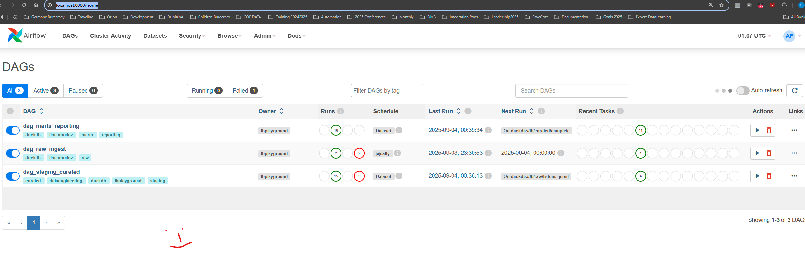

### Running Containers

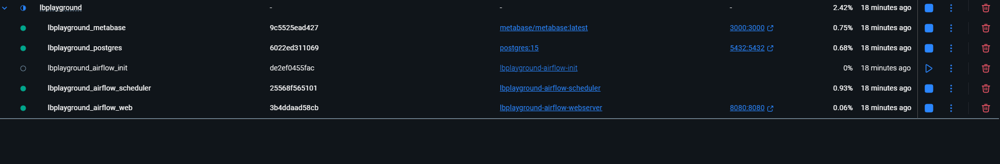

### DAGs

* **Marts & Reporting**
  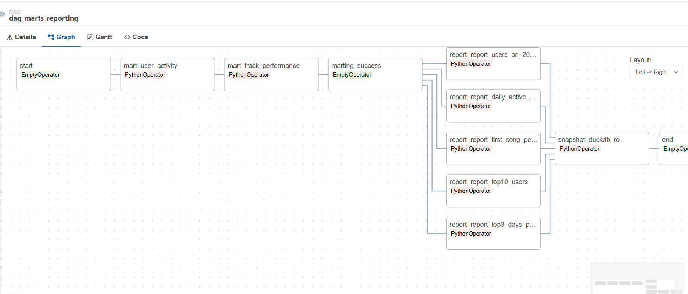
* **Staging & Curated**
  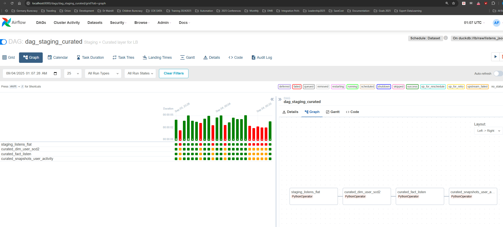

### Data Monitoring

Data monitoring pipeline with **7 different SQL checks** (row count, nulls, duplicates, future dates, overlaps, etc.).
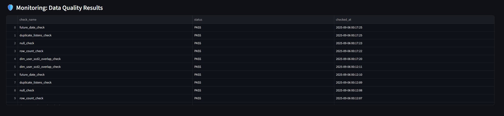

---

## 📊 Reporting (Exploratory Deliverables)

The following reporting views directly answer the assignment questions.
Each is defined in **`airflow/sql/reporting/`** and visualized via **Streamlit** (with screenshots in `reports/`).

### **Q1. Who are the top 10 users by number of songs listened to?**

* **SQL:** [`report_top10_users.sql`](airflow/sql/reporting/report_top10_users.sql)
* **Screenshot:** 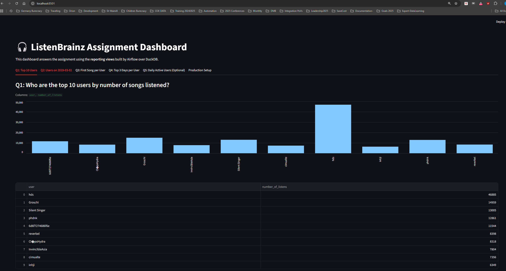

### **Q2. How many users listened on 1st March 2019?**

* **SQL:** [`report_users_on_2019_03_01.sql`](airflow/sql/reporting/report_users_on_2019_03_01.sql)
* **Screenshot:** 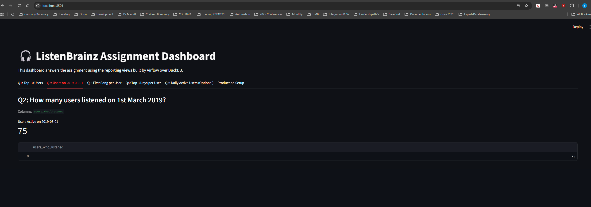

### **Q3. For every user, what was the first song the user listened to?**

* **SQL:** [`report_first_song_per_user.sql`](airflow/sql/reporting/report_first_song_per_user.sql)
* **Screenshot:** 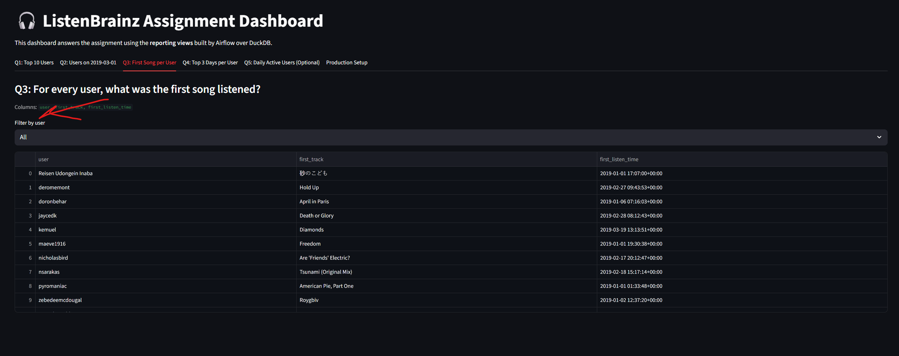

### **Q4. For each user, what were the top 3 days on which they had the most listens?**

* **SQL:** [`report_top3_days_per_user.sql`](airflow/sql/reporting/report_top3_days_per_user.sql)
* **Screenshot:** 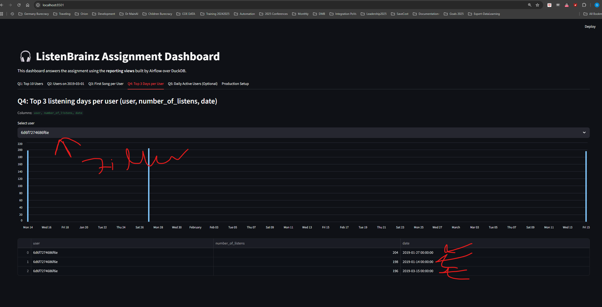

### **Q5. (Optional) Development of active users in a 7-day rolling window**

* **SQL:** [`report_daily_active_users.sql`](airflow/sql/reporting/report_daily_active_users.sql)
* **Screenshot:** 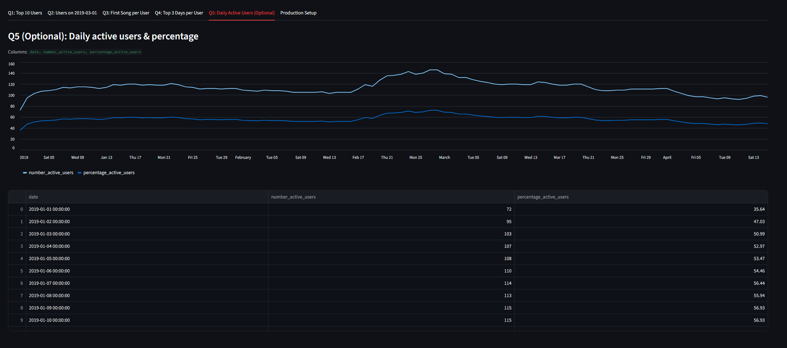


### **DATA Quality SQL checks (later move to great expectations)**

* **SQL:** [`report_daily_active_users.sql`](airflow/sql/production/dq)
* **Screenshot:** 

---

## 🚀 Setup & Deployment

### 1. Clone repo

```bash
git clone https://github.com/shafaypro/lbplayground.git
cd lbplayground
```

### 2. Environment variables

Create `.env`:

NOTE: the original file i renamed to `ds.jsonl` instead of `data.txt` (this should be inside the data folder as speified(in the same level of readme.md)) !!

```env
DUCKDB_PATH=/opt/duckdb/warehouse/lb.duckdb
DATA_GLOB=/opt/data/*.jsonl
SOURCE_FILTER=spotify
AIRFLOW__CORE__LOAD_EXAMPLES=False
```

### 3. Start services

```bash
docker compose up --build
```

Services:

* **Airflow** → [http://localhost:8080](http://localhost:8080) (admin/admin)
* **Streamlit** → [http://localhost:8501](http://localhost:8501)

---

## ▶️ Running Workflows

1. **Raw ingestion** – `dag_raw_ingest` → creates `raw.listens_jsonl`
2. **Staging & Curated** – `dag_staging_curated` → builds `dim_user`, `fact_listen`, `snapshots_user_activity`
3. **Marts & Reporting** – `dag_marts_reporting` → builds marts + reporting views
4. **Monitoring** – `dag_data_quality` → executes 7 DQ SQL checks and stores results in `monitoring.data_quality_results`

---

## 📊 Streamlit BI

* Streamlit queries **`lb_ro.duckdb`** (read-only copy of DuckDB).
* Dashboard: [http://localhost:8501](http://localhost:8501)
* Tabs:

  * **Q1–Q5 reporting views**
  * **Production Setup** (orchestration & infra notes)
  * **All Reports + Monitoring** (consolidated answers + DQ status)

---

## 🏢 Production Setup Notes

While this repo runs **locally with DuckDB + Airflow + Streamlit**, the architecture is designed to **scale in production**:

* **Database** → Swap **DuckDB** for **Snowflake / BigQuery / Redshift** depending on infra needs
* **Orchestration** → Run **Airflow on Kubernetes** (Celery/K8sExecutor)
* **BI Layer** → Replace Streamlit with **Metabase, Superset, Tableau, or PowerBI**
* **Data Quality** → Extend SQL checks with **Great Expectations** or **dbt tests**
* **CI/CD** → Use **GitHub Actions** for DAG + SQL linting, automated tests, deployments
* **Storage** → Replace local JSON with **S3/GCS/Azure Blob**, add CDC via **Kafka/Debezium**

---

## 📚 Further Documentation

* [Airflow Guide](wiki/airflow.md)
* [Infrastructure Setup](wiki/infra.md)
* [Data Model](wiki/data_model.md)
* [Data Dictionary](wiki/data_dictionary.md)
* [DuckDB Usage](wiki/play_duckdb.md)

---

## ⚡ This playground demonstrates how **raw event data** evolves into **analytics-ready insights** through **Airflow + DuckDB + Streamlit** — end-to-end, reproducible, and production-inspired. (just for learning purposes)
