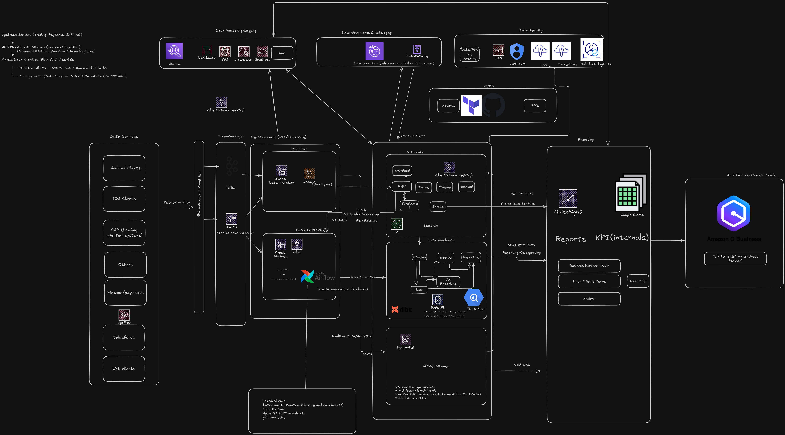

# 3. System Design
## **a) How would you approach this challenge with your team?**

* **Alignment with stakeholders**

  * Engage business leaders and analysts early to clarify outcomes.
  * Define which insights/KPIs matter, who the consumers are (analysts, managers, execs), and what level of latency is required (batch vs real-time).
  * Define the timeline (of deliverables of when the required request needs to be executed- usually ASAP answers are sometimes not realistic)
  * Identify that the usecase has reusable components from other places (like teams/ etc) or can be extended to more projects/poVs
* **Team collaboration & co-design**

  * Run design workshops to map the data flow (event broker → data lake → warehouse → BI).
  * Encourage open trade-off discussions, but make decisive calls to ensure scalability, cost-efficiency, and long-term maintainability.

* **Data requirements gathering**

  * Identify critical data sources and define data contracts.
  * Document assumptions around volumes, freshness, and SLAs.

* **Sprint planning & delivery mapping**

  * Break down the work into clear tasks:

    * Ingestion pipelines (Kafka/Kinesis).
    * Transformations (dbt + Airflow).
    * Governance (catalog, lineage, data quality).
    * BI enablement (marts, semantic layer).
  * Establish 1:1 mappings between deliverables and business outcomes.

* **Timelines & phased execution**

  * Phase 1 (0–3 months): MVP – first sources ingested, raw-to-curated flow, and one high-value dashboard.
  * Phase 2 (3–6 months): Build foundation – curated marts, orchestration, and initial data quality checks.
  * Phase 3 (6–12 months): Governance rollout – catalog, lineage, RBAC, self-service BI; extend to real-time analytics.

* **Task distribution & ownership**

  * Assign clear ownership by domain (ingestion, modeling, BI, governance).
  * Ensure accountability by treating datasets as products with SLAs and documentation.

* **Scalability & resource planning**

  * Start with conservative compute (S3 + mid-tier warehouse, autoscaling workers).
  * Monitor workloads and scale elastically to meet adoption growth.

* **Team culture & passion alignment**

  * Match engineers with areas they are passionate about (e.g., streaming enthusiasts on Kafka, SQL modelers on dbt).
  * Rotate responsibilities to grow full-stack knowledge.
  * Foster a “data as a product” mindset to ensure quality and trust.

* **Delivering insights incrementally**

  * Deliver in small, high-value increments rather than waiting for a “big bang” release.
  * Show progress early (first dashboards), build credibility, and refine based on feedback.

## **b) Which data stack architecture would you choose?**

Below is the high-level data platform architecture I designed to support real-time + batch ingestion, governance, and BI enablement:

TODO: *(short explanation of each layer — ingestion, processing, data lake, warehouse, BI, governance, monitoring).*

---

---

## **c) What technical and organizational challenges might you need to overcome?**
- **Organizational Challenges**
<!-- Refractor the below later:  -->
  <!-- - Driving adoption across business teams  
  - Ensuring access control/security  
  - Balancing central governance with self-service BI  
  - Cross-team collaboration (Eng, Data, BI, Product)   -->

### **Technical Challenges**

* **Schema evolution & data contracts**

  * Upstream services may change event formats without notice.
  * **Mitigation:** enforce contracts via **AWS Glue Schema Registry** and automated CI validation.

* **Real-time vs batch trade-offs**

  * Not all workloads justify the cost/complexity of real-time processing.
  * **Mitigation:** reserve **Kinesis/Flink** for high-value use cases (fraud detection, live KPIs); keep bulk analytics in **batch (S3/dbt)**.

* **Performance & concurrency scaling**

  * Hundreds or thousands of concurrent BI queries can overwhelm the warehouse.
  * **Mitigation:** leverage **Snowflake/Redshift concurrency scaling**, cache heavy queries in **QuickSight SPICE**, and build pre-aggregated marts.

* **Data quality at scale**

  * Nulls, duplicates, and referential issues are inevitable across billions of rows.
  * **Mitigation:** embed **dbt tests**, create **data quality marts**, and monitor with **CloudWatch alerts**.

* **Security & compliance**

  * Sensitive data (PII, financials) requires strict handling.
  * **Mitigation:** enforce **Lake Formation RBAC/ABAC**, apply field-level masking, and ensure encryption in transit and at rest.

---

### **Organizational Challenges**

* **Data ownership & stewardship**

  * Without clear ownership, the data lake risks becoming a swamp.
  * **Mitigation:** assign **domain-level ownership** (e.g., finance owns finance data, product owns telemetry).

* **Cultural adoption**

  * Employees may resist moving from ad-hoc spreadsheets to governed BI.
  * **Mitigation:** provide **training sessions**, publish playbooks, and appoint **BI champions** in each department.

* **Cross-team alignment**

  * Data engineering, BI, product, and compliance may optimize for different goals.
  * **Mitigation:** set **shared OKRs** (e.g., “95% of datasets discoverable & trusted”) to align incentives.

* **Change management**

  * Rolling out a central platform impacts many workflows.
  * **Mitigation:** deliver in **phases** (start with MVP dashboards, then marts, then full governance) to ease adoption.

* **Skill gaps & hiring**

  * Few engineers are fluent across streaming, modeling, and BI enablement.
  * **Mitigation:** build a **balanced team** (streaming specialists, dbt modelers, BI engineers) and encourage **rotation for cross-skilling**.
